# GANI Log 화면 설계서

## 1. 문서 기본 정보

| 항목 | 내용 |
|---|---|
| 프로젝트명 | GANI Log |
| 서비스 설명 | 다이브 컴퓨터 연동 기반 스마트 다이빙 로그북 |
| 문서명 | 화면 설계서 |
| 작성자 | 김가은 |
| 작성일 | 2026-08-19 |
| 버전 | v1.7 |
| 대상 환경 | 웹 데스크톱, 1280px 기준 |
| 주요 사용자 | 개인 다이버 |

### 문서 수정 이력

| 버전 | 수정일 | 작성자 | 수정 내용 |
|---|---|---|---|
| v1.2 | 2026-08-19 | 김가은 | 구현 여부 표현을 제거하고 화면 동작 중심으로 정리 |
| v1.3 | 2026-08-19 | 김가은 | HTML 프로토타입 화면 캡처 13개 추가 |
| v1.4 | 2026-08-19 | 김가은 | 화면별 기본 정보, 캡처와 UI 설명을 한 페이지에서 확인하도록 PDF 구성 변경 |
| v1.5 | 2026-08-19 | 김가은 | 구현 화면으로 오해하지 않도록 캡처를 화면 구성 확인용 와이어프레임으로 명시 |
| v1.6 | 2026-08-19 | 김가은 | 와이어프레임 UI 요소에 디스크립션 표와 대응하는 번호 표시 추가 |
| v1.7 | 2026-08-19 | 김가은 | 로그인, 회원가입, 로그 상세와 내 정보 화면의 UI 번호 위치 보정 |

## 2. 작성 기준

- 화면마다 고유한 화면 ID를 부여한다.
- 화면의 UI 요소에는 번호를 부여하고 동작 조건과 이동 화면을 함께 기록한다.
- 요구사항 ID와 화면 ID를 연결하여 추적할 수 있도록 한다.
- 다이브 컴퓨터에서 가져온 값과 사용자가 입력해야 하는 값을 구분한다.
- SAC는 `bar/min`, RMV는 `L/min`으로 표시한다.
- SAC와 RMV는 실력이나 안전을 판정하는 값이 아니라 기록 비교를 위한 참고 지표로 안내한다.
- 와이어프레임의 예시 수치와 개인 정보는 화면 구성 확인용이며 실제 사용자 데이터가 아니다.
- 화면 와이어프레임은 2026-08-19 기준 HTML 프로토타입을 이용해 화면 구조와 정보 배치를 표현한 설계 예시다.
- 와이어프레임은 실제 구현 완료 화면이 아니며 색상, 문구, 데이터와 세부 배치는 개발 과정에서 변경될 수 있다.
- 화면 와이어프레임의 UI 요소는 화면별 디스크립션 표의 번호를 기준으로 확인한다.
- PDF에서는 와이어프레임의 파란 번호와 디스크립션 표의 `NO`를 동일하게 표시한다.

## 3. 화면 ID 체계

| 구분 | ID 형식 | 설명 |
|---|---|---|
| 인증 | SCR-AUTH-번호 | 로그인, 회원가입 |
| 연동 | SCR-SYNC-번호 | 다이브 컴퓨터 및 파일 연동 |
| 로그 | SCR-LOG-번호 | 로그 확인, 입력, 저장, 조회 |
| 메인 | SCR-MAIN-번호 | 대시보드 |
| 장비 | SCR-EQP-번호 | 개인 장비 관리 |
| 내 정보 | SCR-MY-번호 | 사용자 정보와 자격 관리 |
| 소셜 | SCR-SOCIAL-번호 | 친구, 공유와 버디 로그 |

## 4. 요구사항 ID 체계

| 요구사항 ID | 요구사항명 |
|---|---|
| REQ-FUNC-001 | 로그인 |
| REQ-FUNC-002 | 회원가입 |
| REQ-FUNC-003 | 다이브 컴퓨터 기록 가져오기 |
| REQ-FUNC-004 | 연동 데이터 확인 및 수정 |
| REQ-FUNC-005 | 누락 항목 안내 및 추가 입력 |
| REQ-FUNC-006 | 다이빙 로그 저장 |
| REQ-FUNC-007 | 대시보드 조회 |
| REQ-FUNC-008 | 다이빙 로그 목록 조회 및 검색 |
| REQ-FUNC-009 | 다이빙 로그 상세 조회 |
| REQ-FUNC-010 | SAC·RMV 계산 및 표시 |
| REQ-FUNC-011 | 유사 조건 로그 비교 |
| REQ-FUNC-012 | 웨이트 기록 및 비교 |
| REQ-FUNC-013 | 개인 장비 관리 |
| REQ-FUNC-014 | 사용자 정보 및 자격 관리 |
| REQ-FUNC-015 | 친구 관리 및 로그 공개 범위 설정 |
| REQ-FUNC-016 | 버디 로그 조회 |
| REQ-FUNC-017 | 로그 사진 첨부 |
| REQ-FUNC-018 | 로그 번호 설정 |

## 5. 전체 화면 목록

| 화면 ID | 화면명 | 화면 경로 | 관련 요구사항 | 화면 파일 |
|---|---|---|---|---|
| SCR-AUTH-001 | 로그인 | 시작 > 로그인 | REQ-FUNC-001 | 1-로그인.html |
| SCR-AUTH-002 | 회원가입 | 로그인 > 회원가입 | REQ-FUNC-002 | 2-회원가입.html |
| SCR-SYNC-001 | 연동 방식 선택 | 새 로그 작성 > 1단계 | REQ-FUNC-003 | 3-연동시작.html |
| SCR-LOG-001 | 연동 데이터 확인 | 새 로그 작성 > 2단계 | REQ-FUNC-004 | 4-로그작성-2단계.html |
| SCR-LOG-002 | 추가 정보 입력 | 새 로그 작성 > 3단계 | REQ-FUNC-005, 010, 012, 015, 017 | 10-로그작성-3단계.html |
| SCR-LOG-003 | 최종 확인 및 저장 | 새 로그 작성 > 4단계 | REQ-FUNC-006, 010, 018 | 11-로그작성-4단계.html |
| SCR-MAIN-001 | 대시보드 | 로그인 > 대시보드 | REQ-FUNC-007, 010 | 5-대시보드.html |
| SCR-LOG-004 | 로그 목록 | 사이드바 > 로그 목록 | REQ-FUNC-008 | 6-로그목록.html |
| SCR-LOG-005 | 로그 상세 | 로그 목록 > 로그 상세 | REQ-FUNC-009~012, 015, 017 | 7-로그상세.html |
| SCR-EQP-001 | 장비 관리 | 사이드바 > 장비 관리 | REQ-FUNC-013 | 8-장비관리.html |
| SCR-MY-001 | 내 정보 | 사이드바 > 내 정보 | REQ-FUNC-014, 018 | 9-내정보.html |
| SCR-SOCIAL-001 | 친구·공유 | 사이드바 > 친구·공유 | REQ-FUNC-015 | 12-친구공유.html |
| SCR-SOCIAL-002 | 버디 로그 | 사이드바 > 버디 로그 | REQ-FUNC-016 | 13-버디로그.html |

## 6. 전체 화면 흐름

```text
SCR-AUTH-001 로그인
 ├─ SCR-AUTH-002 회원가입 ─ SCR-MAIN-001 대시보드
 └─ SCR-MAIN-001 대시보드
     ├─ SCR-SYNC-001 연동 방식 선택
     │   └─ SCR-LOG-001 연동 데이터 확인
     │       └─ SCR-LOG-002 추가 정보 입력
     │           └─ SCR-LOG-003 최종 확인 및 저장
     │               └─ SCR-MAIN-001 대시보드
     ├─ SCR-LOG-004 로그 목록 ─ SCR-LOG-005 로그 상세
     ├─ SCR-SOCIAL-001 친구·공유 ─ SCR-LOG-005 로그 상세
     ├─ SCR-SOCIAL-002 버디 로그 ─ SCR-LOG-005 로그 상세
     ├─ SCR-EQP-001 장비 관리
     └─ SCR-MY-001 내 정보
```

---

# 7. 화면별 상세 설계

## 7.1 SCR-AUTH-001 로그인

### 화면 와이어프레임

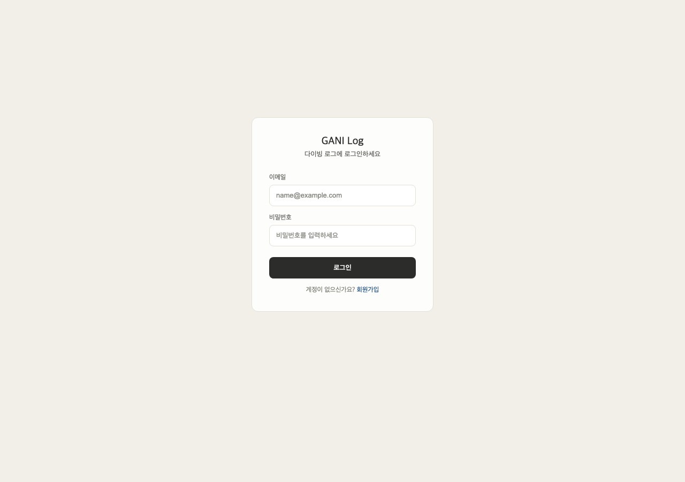

### 기본 정보

| 항목 | 내용 |
|---|---|
| 화면명 | 로그인 |
| 화면 목적 | 계정 인증 후 개인 로그와 장비 정보에 접근한다. |
| 초기 상태 | 이메일과 비밀번호 입력란은 비어 있고 로그인 버튼은 비활성화된다. |
| 관련 요구사항 | REQ-FUNC-001 |
| 이동 경로 | 로그인 성공 시 SCR-MAIN-001, 회원가입 클릭 시 SCR-AUTH-002 |

### 디스크립션

| NO | 매핑 요구사항 ID | UI 요소명 | 인터랙션 및 로직 정의 | 이동 화면/비고 |
|---:|---|---|---|---|
| ① | REQ-FUNC-001 | 이메일 입력 필드 | 이메일을 입력한다. 형식이 맞지 않으면 필드 아래에 오류 문구를 표시한다. | Placeholder: name@example.com |
| ② | REQ-FUNC-001 | 비밀번호 입력 필드 | 비밀번호를 마스킹하여 입력한다. | 입력 필수 |
| ③ | REQ-FUNC-001 | 로그인 버튼 | 두 입력값이 유효하면 활성화한다. 클릭 시 인증을 요청하고 처리 중 상태를 표시한다. | 성공: SCR-MAIN-001 |
| ④ | REQ-FUNC-002 | 회원가입 링크 | 클릭 시 회원가입 화면으로 이동한다. | SCR-AUTH-002 |

### 예외 처리

- 이메일 형식 오류 또는 비밀번호 불일치 시 각 입력 필드 아래에 오류 문구를 표시한다.
- 서버 또는 네트워크 오류 발생 시 입력값을 유지하고 다시 시도할 수 있도록 안내한다.

## 7.2 SCR-AUTH-002 회원가입

### 화면 와이어프레임

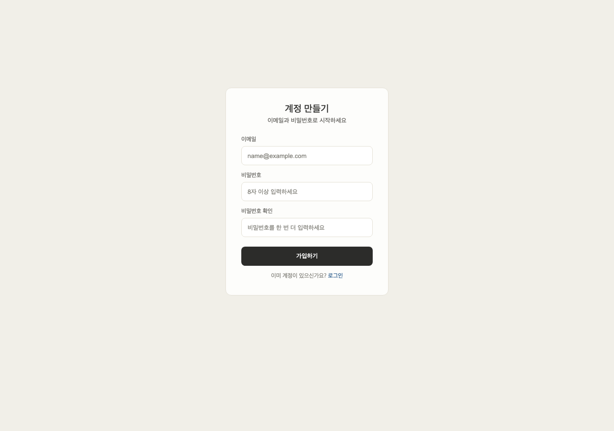

### 기본 정보

| 항목 | 내용 |
|---|---|
| 화면명 | 회원가입 |
| 화면 목적 | 이메일과 비밀번호로 계정을 생성한다. |
| 초기 상태 | 모든 입력란은 비어 있고 가입하기 버튼은 비활성화된다. |
| 관련 요구사항 | REQ-FUNC-002 |
| 이동 경로 | 가입 성공 시 SCR-MAIN-001, 로그인 링크 클릭 시 SCR-AUTH-001 |

### 디스크립션

| NO | 매핑 요구사항 ID | UI 요소명 | 인터랙션 및 로직 정의 | 이동 화면/비고 |
|---:|---|---|---|---|
| ① | REQ-FUNC-002 | 이메일 입력 필드 | 이메일을 입력하고 형식을 검사한다. | 입력 필수 |
| ② | REQ-FUNC-002 | 비밀번호 입력 필드 | 안내된 조건에 맞춰 비밀번호를 입력한다. | 입력 필수 |
| ③ | REQ-FUNC-002 | 비밀번호 확인 필드 | 비밀번호와 같은 값인지 확인한다. | 불일치 시 오류 표시 |
| ④ | REQ-FUNC-002 | 가입하기 버튼 | 모든 입력값이 유효할 때 활성화한다. 클릭 시 계정 생성을 요청한다. | 성공: SCR-MAIN-001 |
| ⑤ | REQ-FUNC-001 | 로그인 링크 | 기존 사용자가 로그인 화면으로 돌아간다. | SCR-AUTH-001 |

### 예외 처리

- 이미 가입된 이메일이면 해당 사실을 안내한다.
- 비밀번호와 비밀번호 확인 값이 다르면 확인 필드 아래에 오류를 표시한다.

## 7.3 SCR-SYNC-001 연동 방식 선택

### 화면 와이어프레임

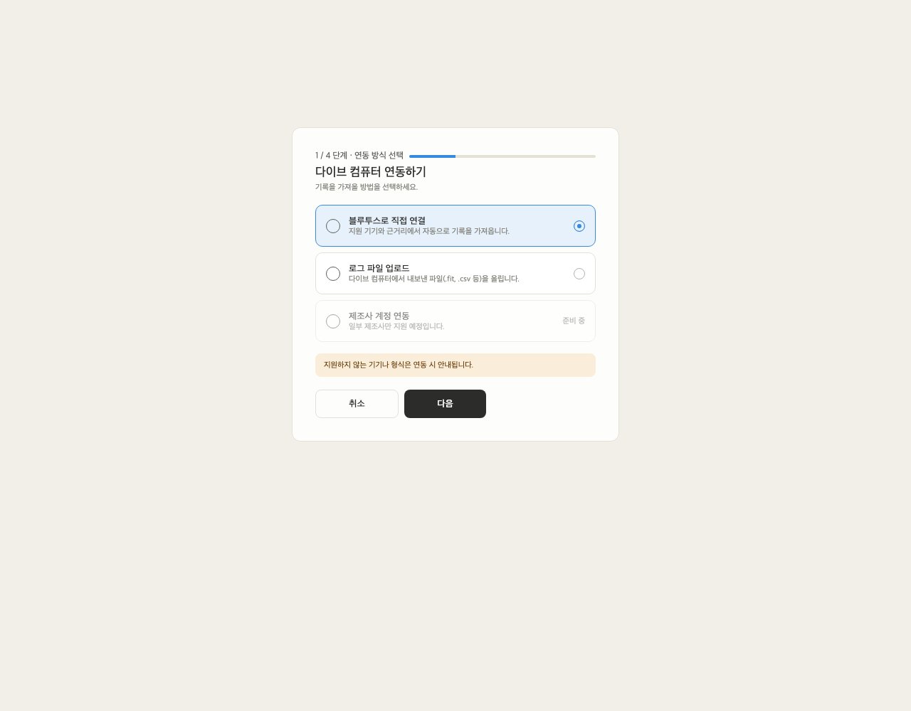

### 기본 정보

| 항목 | 내용 |
|---|---|
| 화면명 | 다이브 컴퓨터 연동하기 - 1/4단계 |
| 화면 목적 | 다이빙 기록을 가져올 방식을 선택한다. |
| 초기 상태 | 블루투스 직접 연결이 기본 선택된다. 제조사 계정 연동은 비활성화된다. |
| 관련 요구사항 | REQ-FUNC-003 |
| 이동 경로 | 다음 클릭 시 선택 방식으로 연동 후 SCR-LOG-001 |

### 디스크립션

| NO | 매핑 요구사항 ID | UI 요소명 | 인터랙션 및 로직 정의 | 이동 화면/비고 |
|---:|---|---|---|---|
| ① | REQ-FUNC-003 | 단계 표시 | 현재 단계가 1/4임을 텍스트와 진행 바로 표시한다. | 25% |
| ② | REQ-FUNC-003 | 블루투스 직접 연결 | 선택 시 지원 기기를 탐색하고 연결 대상으로 지정한다. | 선택 가능 |
| ③ | REQ-FUNC-003 | 로그 파일 업로드 | 선택 시 파일 선택 영역을 표시하고 지원 형식을 검사한다. | 선택 가능 |
| ④ | REQ-FUNC-003 | 제조사 계정 연동 | 준비 중 상태로 표시하며 선택할 수 없다. | 비활성화 |
| ⑤ | REQ-FUNC-003 | 취소 버튼 | 새 로그 작성을 중단하고 이전 화면으로 돌아간다. | SCR-MAIN-001 |
| ⑥ | REQ-FUNC-003 | 다음 버튼 | 선택한 방식으로 기록 가져오기를 시작한다. 처리 중에는 중복 클릭을 막는다. | 성공: SCR-LOG-001 |

### 예외 처리

- 지원하지 않는 기기 또는 파일 형식이면 연동할 수 없는 이유를 표시한다.
- 연결 실패 시 재시도와 다른 연동 방식 선택을 제공한다.
- 파일 안에 다이빙 기록이 없으면 확인 가능한 기록이 없다고 안내한다.

## 7.4 SCR-LOG-001 연동 데이터 확인

### 화면 와이어프레임

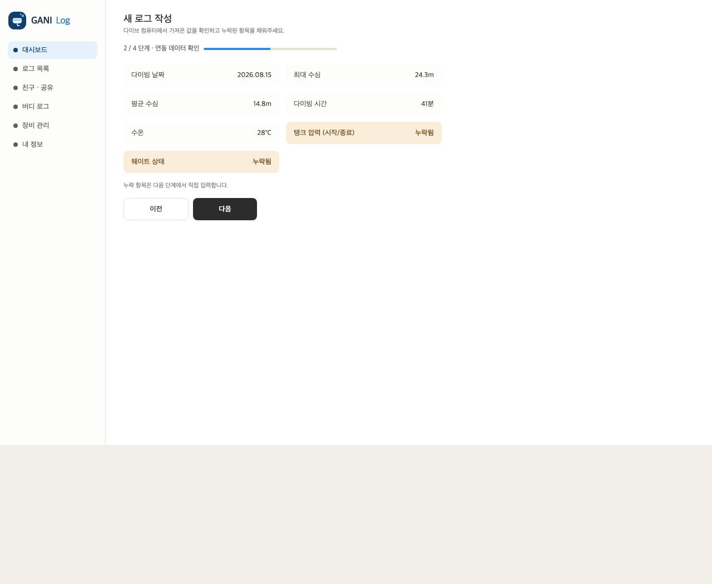

### 기본 정보

| 항목 | 내용 |
|---|---|
| 화면명 | 연동 데이터 확인 - 2/4단계 |
| 화면 목적 | 다이브 컴퓨터에서 가져온 값과 누락된 값을 구분해 확인한다. |
| 초기 상태 | 가져온 값은 정보 카드로, 누락 값은 경고 카드로 표시한다. |
| 관련 요구사항 | REQ-FUNC-004 |
| 이동 경로 | 이전: SCR-SYNC-001, 다음: SCR-LOG-002 |

### 표시 데이터

| 구분 | 항목 | 표시 규칙 |
|---|---|---|
| 자동 입력 후보 | 날짜, 다이빙 시간, 평균 수심, 최대 수심, 수온 | 연동 데이터가 있을 때 값 표시 |
| 누락 가능 항목 | 탱크 용량, 시작·종료 압력, 장비, 웨이트, 웨이트 상태, 환경 정보 | 값이 없으면 `누락됨` 표시 |

### 디스크립션

| NO | 매핑 요구사항 ID | UI 요소명 | 인터랙션 및 로직 정의 | 이동 화면/비고 |
|---:|---|---|---|---|
| ① | REQ-FUNC-004 | 단계 표시 | 현재 단계 2/4와 진행률을 표시한다. | 50% |
| ② | REQ-FUNC-004 | 자동 입력 카드 | 다이브 컴퓨터에서 가져온 값을 표시한다. 수정 가능한 항목은 사용자가 변경할 수 있다. | 값 출처 구분 |
| ③ | REQ-FUNC-004 | 누락 항목 카드 | 가져오지 못한 항목을 경고 색상과 `누락됨`으로 표시한다. | 다음 단계에서 입력 |
| ④ | REQ-FUNC-004 | 이전 버튼 | 연동 방식 선택 화면으로 돌아간다. | SCR-SYNC-001 |
| ⑤ | REQ-FUNC-005 | 다음 버튼 | 확인한 데이터를 유지하고 추가 정보 입력 화면으로 이동한다. | SCR-LOG-002 |

### 예외 처리

- 같은 일시의 기록이 이미 있으면 중복 가능성을 표시하고 계속 진행 여부를 확인한다.
- 평균 수심이 없으면 SAC·RMV 계산에 제한이 생길 수 있음을 안내한다.

## 7.5 SCR-LOG-002 추가 정보 입력

### 화면 와이어프레임

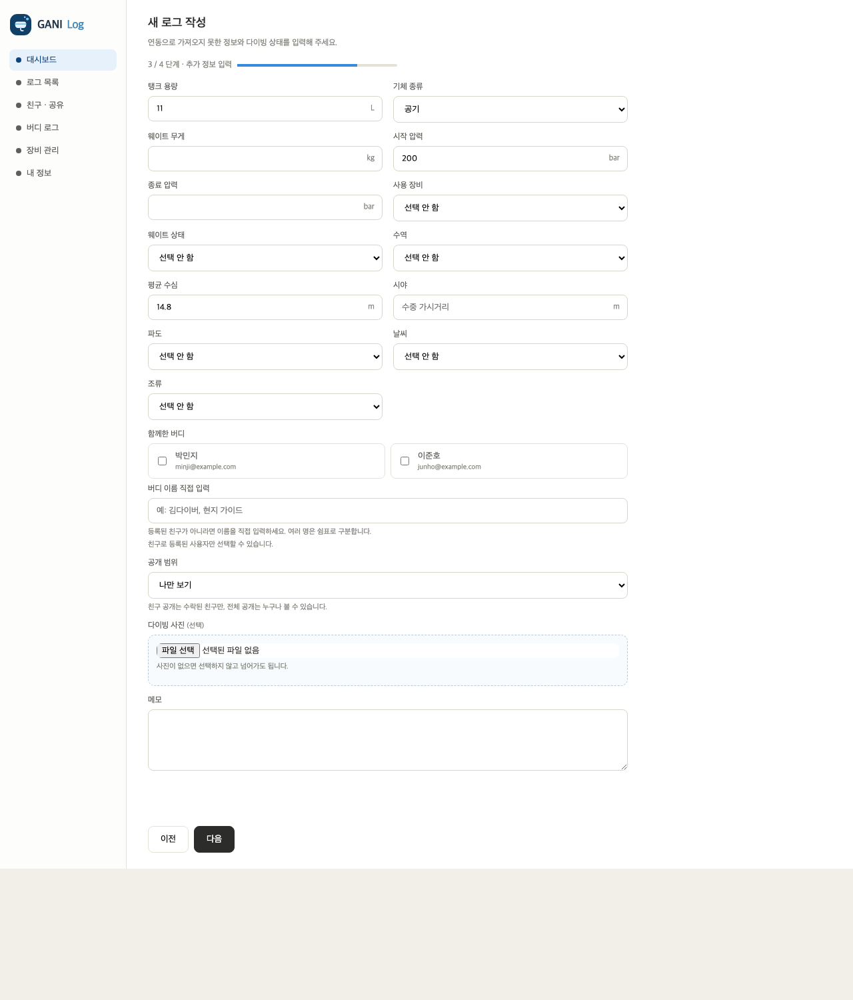

### 기본 정보

| 항목 | 내용 |
|---|---|
| 화면명 | 추가 정보 입력 - 3/4단계 |
| 화면 목적 | 연동으로 가져오지 못한 분석·비교용 정보를 사용자가 입력한다. |
| 초기 상태 | 자동 입력값은 채워진 상태로 유지하고 누락된 항목만 입력 대상으로 표시한다. |
| 관련 요구사항 | REQ-FUNC-005, REQ-FUNC-010, REQ-FUNC-012, REQ-FUNC-015, REQ-FUNC-017 |
| 이동 경로 | 이전: SCR-LOG-001, 다음: SCR-LOG-003 |

### 입력 항목

| NO | 매핑 요구사항 ID | UI 요소명 | 입력 방식 및 로직 | 필수 여부 |
|---:|---|---|---|---|
| ① | REQ-FUNC-010 | 탱크 용량 | 등록 장비 선택 또는 숫자 입력, 단위 L | RMV 계산 시 필수 |
| ② | REQ-FUNC-010 | 시작·종료 압력 | 숫자 입력, 단위 bar. 종료 압력은 시작 압력보다 작아야 한다. | SAC 계산 시 필수 |
| ③ | REQ-FUNC-005 | 기체 종류 | 공기 또는 나이트록스를 선택한다. 공기는 산소 21%를 적용하고, 나이트록스는 산소 비율을 입력한다. | 기체 기록 시 필수 |
| ④ | REQ-FUNC-012 | 웨이트 무게 | 숫자 입력, 단위 kg | 웨이트 비교 시 필수 |
| ⑤ | REQ-FUNC-012 | 웨이트 상태 | 가벼웠음·적절했음·무거웠음 중 하나를 선택한다. | 선택 |
| ⑥ | REQ-FUNC-013 | 사용 장비 | 등록 장비 또는 렌탈 장비를 선택한다. | 선택 |
| ⑦ | REQ-FUNC-005 | 바다 환경 | 수역, 평균 수심, 시야, 파도, 날씨, 조류를 입력한다. | 선택 |
| ⑧ | REQ-FUNC-015 | 버디 | 등록 친구를 선택하거나 등록되지 않은 버디 이름을 직접 입력한다. 여러 명은 쉼표로 구분한다. | 선택 |
| ⑨ | REQ-FUNC-015 | 공개 범위 | 나만 보기, 친구 공개, 전체 공개 중 하나를 선택한다. | 기본값: 나만 보기 |
| ⑩ | REQ-FUNC-017 | 다이빙 사진 | 이미지 파일을 여러 장 첨부하고 미리보기에서 삭제할 수 있다. | 선택 |
| ⑪ | REQ-FUNC-005 | 메모 | 사용자가 필요한 내용을 자유롭게 입력한다. | 선택 |
| ⑫ | REQ-FUNC-005 | 이전/다음 버튼 | 이전은 입력값을 유지한 채 SCR-LOG-001로, 다음은 유효성 검사 후 SCR-LOG-003으로 이동한다. | - |

### 예외 처리

- 압력, 탱크 용량, 웨이트에 숫자가 아닌 값이 입력되면 필드 아래에 오류를 표시한다.
- SAC·RMV 계산값이 필요한 경우 필수 데이터가 없으면 누락 항목을 안내한다.
- 선택 항목은 비워 둔 상태로 다음 단계로 이동할 수 있다.

## 7.6 SCR-LOG-003 최종 확인 및 저장

### 화면 와이어프레임

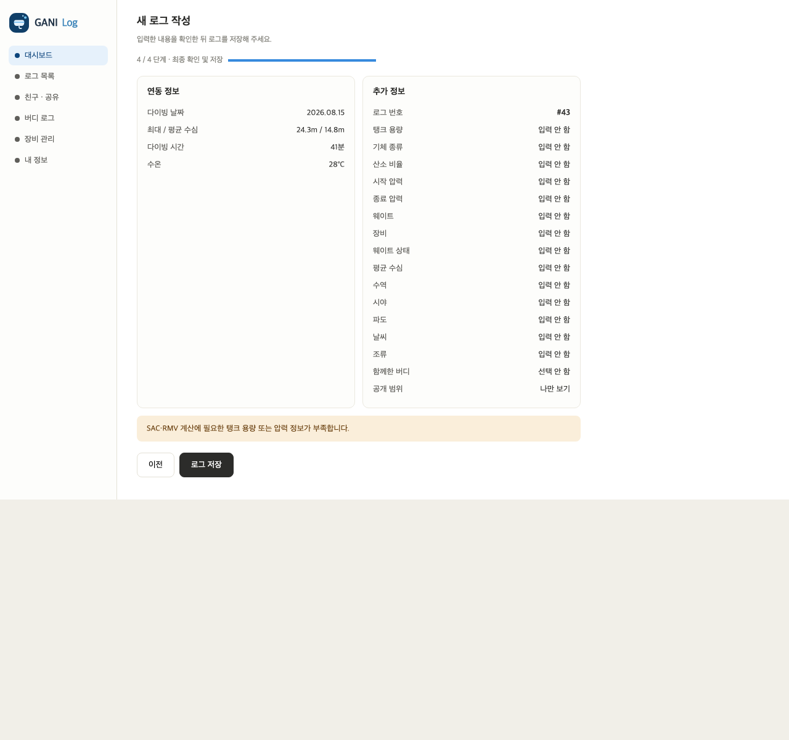

### 기본 정보

| 항목 | 내용 |
|---|---|
| 화면명 | 최종 확인 및 저장 - 4/4단계 |
| 화면 목적 | 자동 입력값과 직접 입력값을 한 번에 검토하고 로그를 저장한다. |
| 초기 상태 | 입력한 내용을 기본 정보, 장비, 환경, 분석 준비 상태로 나누어 표시한다. |
| 관련 요구사항 | REQ-FUNC-006, REQ-FUNC-010, REQ-FUNC-018 |
| 이동 경로 | 저장 성공 시 SCR-MAIN-001 |

### 디스크립션

| NO | 매핑 요구사항 ID | UI 요소명 | 인터랙션 및 로직 정의 | 이동 화면/비고 |
|---:|---|---|---|---|
| ① | REQ-FUNC-006 | 단계 표시 | 현재 단계 4/4와 완료 상태를 표시한다. | 100% |
| ② | REQ-FUNC-006 | 입력 내용 요약 | 자동 입력값과 직접 입력값을 영역별로 표시한다. | 읽기 상태 |
| ③ | REQ-FUNC-006 | 이전 버튼 | 추가 정보 입력 단계로 돌아가 내용을 수정한다. | SCR-LOG-002 |
| ④ | REQ-FUNC-010 | 분석 가능 상태 | SAC·RMV 계산에 필요한 데이터가 갖춰졌는지 표시한다. | 누락 시 항목 안내 |
| ⑤ | REQ-FUNC-006 | 로그 저장 버튼 | 최종 로그를 저장하고 다음 로그 번호를 1 증가시킨다. 저장 중에는 버튼을 비활성화한다. | 성공: SCR-MAIN-001 |

### 예외 처리

- 저장 실패 시 입력 내용을 유지하고 재시도 메시지를 표시한다.
- 중복 가능성이 있는 기록은 저장 전에 다시 확인한다.

## 7.7 SCR-MAIN-001 대시보드

### 화면 와이어프레임

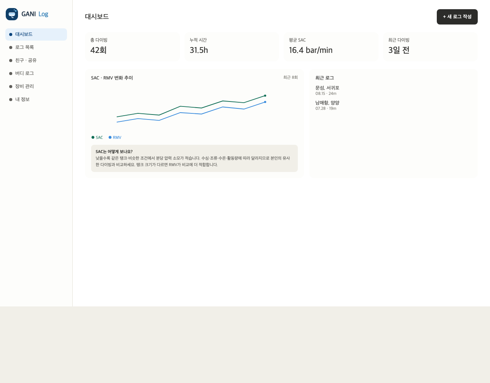

### 기본 정보

| 항목 | 내용 |
|---|---|
| 화면명 | 대시보드 |
| 화면 목적 | 누적 기록, 최근 로그와 공기 소모 변화를 요약해 보여준다. |
| 초기 상태 | 사용자의 저장된 로그를 기준으로 요약 정보를 표시한다. |
| 관련 요구사항 | REQ-FUNC-007, REQ-FUNC-010 |
| 공통 구조 | 좌측 고정 사이드바 190px, 우측 콘텐츠 영역 |

### 디스크립션

| NO | 매핑 요구사항 ID | UI 요소명 | 인터랙션 및 로직 정의 | 이동 화면/비고 |
|---:|---|---|---|---|
| ① | REQ-FUNC-003 | 새 로그 작성 버튼 | 클릭 시 다이브 컴퓨터 연동 흐름을 시작한다. | SCR-SYNC-001 |
| ② | REQ-FUNC-007 | 통계 카드 | 총 다이빙, 누적 시간, 평균 SAC, 최근 다이빙을 표시한다. | 로그가 없으면 `-` 표시 |
| ③ | REQ-FUNC-010 | SAC·RMV 추이 차트 | SAC와 RMV를 서로 다른 선과 단위로 표시한다. | SAC: bar/min, RMV: L/min |
| ④ | REQ-FUNC-008 | 최근 로그 목록 | 최근 로그를 표시하고 선택 시 상세 화면으로 이동한다. | SCR-LOG-005 |
| ⑤ | 공통 | 사이드바 | 대시보드, 로그 목록, 친구·공유, 버디 로그, 장비 관리, 내 정보로 이동한다. | 선택한 메뉴 강조 |

### 빈 상태 및 예외 처리

- 로그가 없으면 통계와 차트 대신 `첫 다이빙 기록 가져오기` 버튼을 표시한다.
- 분석 가능한 로그가 부족하면 차트 영역에 필요한 기록 조건을 안내한다.

## 7.8 SCR-LOG-004 로그 목록

### 화면 와이어프레임

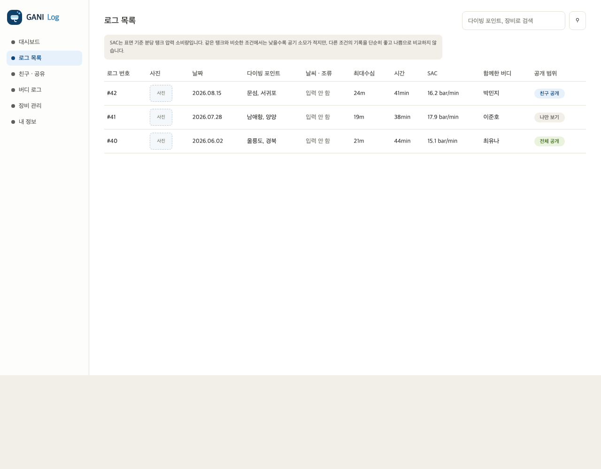

### 기본 정보

| 항목 | 내용 |
|---|---|
| 화면명 | 로그 목록 |
| 화면 목적 | 저장된 다이빙 기록을 검색하고 상세 내용을 연다. |
| 관련 요구사항 | REQ-FUNC-008 |
| 이동 경로 | 행 클릭 시 SCR-LOG-005 |

### 디스크립션

| NO | 매핑 요구사항 ID | UI 요소명 | 인터랙션 및 로직 정의 | 이동 화면/비고 |
|---:|---|---|---|---|
| ① | REQ-FUNC-008 | 검색창 | 다이빙 포인트 또는 장비 이름으로 목록을 검색한다. | 입력 즉시 또는 검색 실행 |
| ② | REQ-FUNC-008 | 필터 버튼 | 기간, 장비, 로그 상태 등의 필터를 표시한다. | 적용 조건 표시 |
| ③ | REQ-FUNC-008 | 로그 테이블 | 날짜, 포인트, 최대 수심, 시간, SAC를 표시한다. | SAC 단위 bar/min |
| ④ | REQ-FUNC-009 | 로그 행 | 행 클릭 시 해당 로그 상세로 이동한다. | SCR-LOG-005 |

### 빈 상태 및 예외 처리

- 검색 결과가 없으면 조건과 일치하는 로그가 없다고 안내한다.
- 저장된 로그가 없으면 새 로그 작성 버튼을 표시한다.

## 7.9 SCR-LOG-005 로그 상세

### 화면 와이어프레임

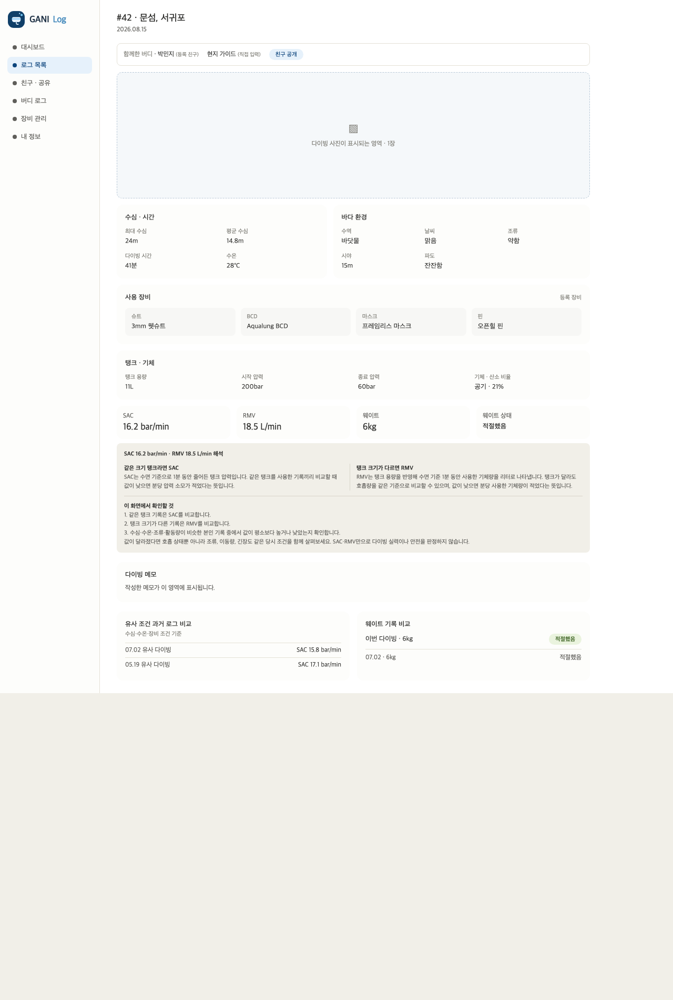

### 기본 정보

| 항목 | 내용 |
|---|---|
| 화면명 | 로그 상세 |
| 화면 목적 | 한 번의 다이빙에서 저장한 기본 정보, 버디, 장비, 환경, 기체와 계산·비교 결과를 확인한다. |
| 관련 요구사항 | REQ-FUNC-009~012, REQ-FUNC-015, REQ-FUNC-017 |
| 진입 경로 | 대시보드 최근 로그 또는 로그 목록 |

### 디스크립션

| NO | 매핑 요구사항 ID | UI 요소명 | 인터랙션 및 로직 정의 | 이동 화면/비고 |
|---:|---|---|---|---|
| ① | REQ-FUNC-009, 018 | 로그 식별 정보 | 로그 번호, 포인트와 날짜를 표시한다. | 예: `#42 · 문섬, 서귀포` |
| ② | REQ-FUNC-015 | 버디·공개 범위 | 등록 친구와 직접 입력한 버디를 구분하고 공개 범위를 표시한다. | 나만 보기·친구 공개·전체 공개 |
| ③ | REQ-FUNC-017 | 사진 영역 | 첨부된 다이빙 사진과 사진 수를 표시한다. 사진이 없으면 영역을 숨기거나 빈 상태를 안내한다. | 읽기 상태 |
| ④ | REQ-FUNC-009 | 수심·시간 | 최대 수심과 평균 수심을 같은 줄에 배치하고 다이빙 시간, 수온을 함께 표시한다. | 단위 m, min, °C |
| ⑤ | REQ-FUNC-009 | 바다 환경 | 수역, 날씨, 조류, 시야, 파도를 한 카테고리로 표시한다. | 미입력 값 구분 |
| ⑥ | REQ-FUNC-013 | 사용 장비 | 로그에 저장된 슈트, BCD, 마스크, 핀 등의 장비 이름과 종류를 표시한다. | 등록·렌탈 장비 구분 가능 |
| ⑦ | REQ-FUNC-009, 010 | 탱크·기체 | 탱크 용량, 시작·종료 압력, 공기·나이트록스와 산소 비율을 표시한다. | 단위 L, bar, % |
| ⑧ | REQ-FUNC-010 | SAC·RMV 카드 | SAC는 `bar/min`, RMV는 `L/min`으로 표시하고 두 지표의 비교 방법을 설명한다. | 계산 불가 시 누락값 표시 |
| ⑨ | REQ-FUNC-012 | 웨이트 정보 | 웨이트 무게와 가벼웠음·적절했음·무거웠음 상태를 표시한다. | 추천값으로 표현하지 않음 |
| ⑩ | REQ-FUNC-009 | 다이빙 메모 | 작성 단계에서 저장한 자유 입력 메모를 표시한다. | 미작성 시 빈 상태 표시 |
| ⑪ | REQ-FUNC-011 | 유사 로그 비교 | 수심, 수온, 장비 등 비교 기준과 과거 기록의 SAC를 표시한다. 항목 클릭 시 해당 과거 로그 상세로 이동한다. | 기록 부족 시 안내 |
| ⑫ | REQ-FUNC-012 | 웨이트 비교 | 현재와 과거의 웨이트 무게 및 상태 평가를 표시한다. | 추천값으로 표현하지 않음 |

### 공통 안내

- `SAC·RMV는 참고 지표이며 실력이나 안전을 판정하지 않습니다.`를 계산 결과 가까이에 표시한다.
- 웨이트 비교는 과거 기록을 보여주는 기능이며 최적 웨이트로 단정하지 않는다.

## 7.10 SCR-EQP-001 장비 관리

### 화면 와이어프레임

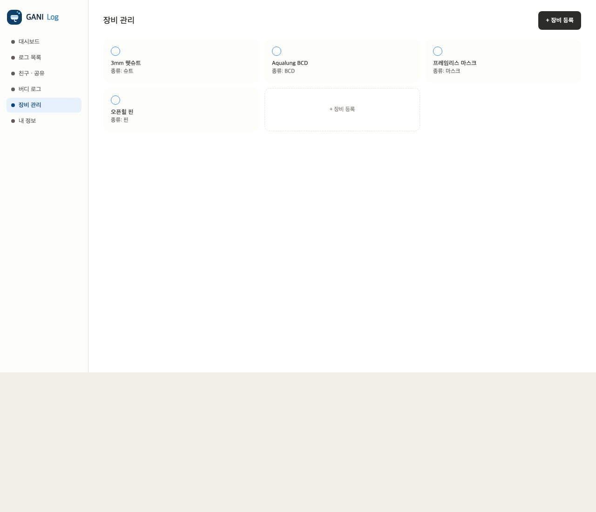

### 기본 정보

| 항목 | 내용 |
|---|---|
| 화면명 | 장비 관리 |
| 화면 목적 | 자주 사용하는 장비를 저장하여 로그 입력 시 재사용한다. |
| 관련 요구사항 | REQ-FUNC-013 |
| 진입 경로 | 사이드바 > 장비 관리 |

### 디스크립션

| NO | 매핑 요구사항 ID | UI 요소명 | 인터랙션 및 로직 정의 | 이동 화면/비고 |
|---:|---|---|---|---|
| ① | REQ-FUNC-013 | 장비 등록 버튼 | 장비 종류와 세부 정보를 입력하는 등록 영역을 연다. | 입력 모달 또는 별도 화면 |
| ② | REQ-FUNC-013 | 장비 카드 | 장비 이름과 종류를 표시한다. 선택 시 수정·삭제 기능을 제공한다. | 슈트, BCD, 호흡기, 마스크, 핀, 다이브 컴퓨터 등 |
| ③ | REQ-FUNC-013 | 장비 추가 카드 | 클릭 시 장비 등록 기능을 연다. | ①과 동일 동작 |

### 예외 처리

- 로그에서 사용 중인 장비 삭제 시 기존 로그에는 기록된 장비 정보가 유지됨을 안내한다.
- 필수 정보가 없는 장비는 저장하지 않고 누락 항목을 표시한다.

## 7.11 SCR-MY-001 내 정보

### 화면 와이어프레임

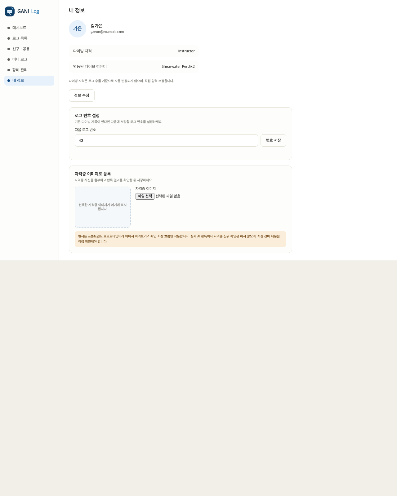

### 기본 정보

| 항목 | 내용 |
|---|---|
| 화면명 | 내 정보 |
| 화면 목적 | 사용자 기본 정보, 로그 시작 번호, 다이빙 자격과 연동 기기를 확인하고 수정한다. |
| 관련 요구사항 | REQ-FUNC-014, REQ-FUNC-018 |
| 진입 경로 | 사이드바 > 내 정보 |

### 디스크립션

| NO | 매핑 요구사항 ID | UI 요소명 | 인터랙션 및 로직 정의 | 이동 화면/비고 |
|---:|---|---|---|---|
| ① | REQ-FUNC-014 | 프로필 영역 | 사용자 이름과 이메일을 표시한다. | 계정 정보 사용 |
| ② | REQ-FUNC-014 | 다이빙 자격 | 자격증 이미지와 사용자가 확인·저장한 발급 단체, 등급, 자격번호, 발급일을 표시한다. | 로그 수로 자동 변경하지 않음 |
| ③ | REQ-FUNC-003 | 연동 기기 | 현재 연결하거나 등록한 다이브 컴퓨터를 표시한다. | 미연동 상태 구분 |
| ④ | REQ-FUNC-014 | 정보 수정 버튼 | 이름과 이메일을 수정할 수 있는 상태로 전환한다. 다이빙 자격은 이 폼에서 직접 수정하지 않는다. | 저장·취소 제공 |
| ⑤ | REQ-FUNC-018 | 로그 시작 번호 | 다음에 저장할 로그 번호를 양의 정수로 설정한다. | 기존 로그를 중간부터 옮기는 사용자 지원 |
| ⑥ | REQ-FUNC-014 | 자격증 이미지 등록 | 이미지에서 발급 단체, 등급, 자격번호와 발급일 후보를 판독한다. 사용자가 결과를 확인·수정한 뒤 저장한다. | 판독 결과를 확정 정보로 자동 저장하지 않음 |

### 예외 처리

- 연동된 기기가 없으면 `연동된 기기 없음`과 연동 시작 버튼을 표시한다.
- 자격 정보가 없으면 자격증 이미지 등록 영역을 안내한다.
- 이미지 용량이 허용 범위를 초과하면 더 작은 이미지를 선택하도록 안내한다.

## 7.12 SCR-SOCIAL-001 친구·공유

### 화면 와이어프레임

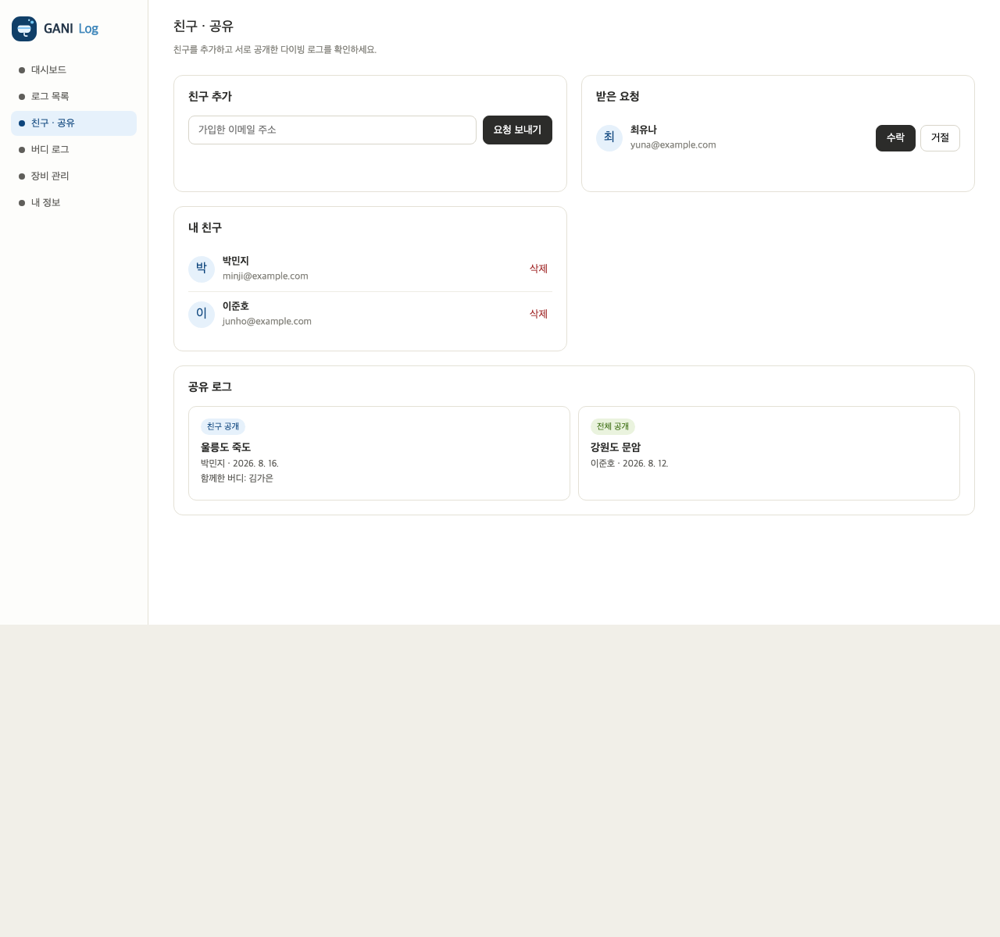

### 기본 정보

| 항목 | 내용 |
|---|---|
| 화면명 | 친구·공유 |
| 화면 목적 | 이메일로 친구를 추가하고 공개된 로그를 함께 확인한다. |
| 관련 요구사항 | REQ-FUNC-015 |
| 진입 경로 | 사이드바 > 친구·공유 |

### 디스크립션

| NO | 매핑 요구사항 ID | UI 요소명 | 인터랙션 및 로직 정의 | 이동 화면/비고 |
|---:|---|---|---|---|
| ① | REQ-FUNC-015 | 친구 추가 | 가입 이메일을 입력해 친구 요청을 보낸다. | 본인·기등록 친구 요청 제한 |
| ② | REQ-FUNC-015 | 받은 요청 | 요청을 수락해 친구 목록에 추가하거나 거절한다. | 처리 후 목록 갱신 |
| ③ | REQ-FUNC-015 | 내 친구 | 수락된 친구의 이름과 이메일을 표시하고 삭제 기능을 제공한다. | 삭제 전 대상 확인 |
| ④ | REQ-FUNC-015 | 공유 로그 | 본인과 친구의 친구 공개·전체 공개 로그, 작성자, 날짜, 버디와 대표 사진을 표시한다. 선택 시 해당 로그 상세로 이동한다. | 나만 보기 로그 제외, SCR-LOG-005 |

## 7.13 SCR-SOCIAL-002 버디 로그

### 화면 와이어프레임

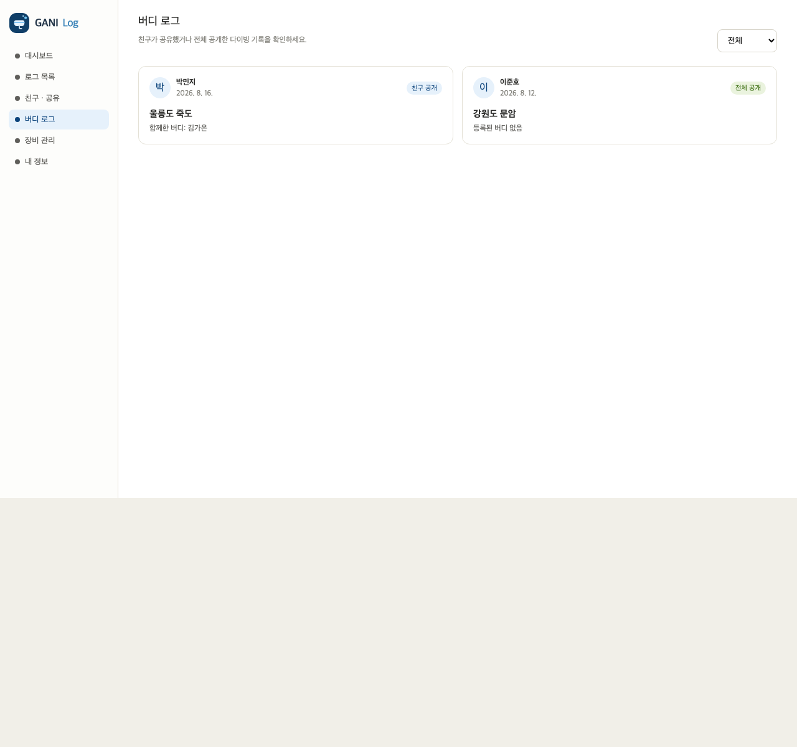

### 기본 정보

| 항목 | 내용 |
|---|---|
| 화면명 | 버디 로그 |
| 화면 목적 | 친구가 공유했거나 전체 공개한 다이빙 기록을 모아 확인한다. |
| 관련 요구사항 | REQ-FUNC-016 |
| 진입 경로 | 사이드바 > 버디 로그 |

### 디스크립션

| NO | 매핑 요구사항 ID | UI 요소명 | 인터랙션 및 로직 정의 | 이동 화면/비고 |
|---:|---|---|---|---|
| ① | REQ-FUNC-016 | 공개 범위 필터 | 전체, 친구 공개, 전체 공개 중 하나를 선택해 목록을 필터링한다. | 기본값: 전체 |
| ② | REQ-FUNC-016 | 버디 로그 카드 | 작성자, 날짜, 공개 범위, 포인트, 함께한 버디와 대표 사진을 표시한다. 선택 시 해당 로그 상세로 이동한다. | SCR-LOG-005, 결과가 없으면 빈 상태 표시 |

---

## 8. 공통 UI 및 정책

| 구분 | 적용 기준 |
|---|---|
| 전체 레이아웃 | 로그인·회원가입·연동 시작은 중앙 카드, 로그인 이후는 190px 사이드바와 콘텐츠 영역으로 구성한다. |
| 화면 크기 | 데스크톱 1280px 기준으로 설계한다. |
| 색상 | 아이보리 계열 배경, 흰색 콘텐츠, 파란색 선택·강조, 초록색 성공, 주황색 경고를 사용한다. |
| 카드 | 모서리 12px, 0.5px 수준의 옅은 테두리, 그림자와 그라디언트는 사용하지 않는다. |
| 버튼·입력창 | 모서리 8px, 기본 높이 40px로 구성한다. |
| 타이포그래피 | 화면 타이틀 18~20px, 카드 제목 13~15px, 본문 13~14px, 캡션 11~12px를 사용한다. |
| 자동 입력 구분 | 다이브 컴퓨터에서 가져온 값임을 라벨이나 상태로 표시한다. |
| 필수·선택 구분 | 필수 입력과 선택 입력을 라벨로 구분하고, 오류는 해당 입력 필드 가까이에 표시한다. |
| 단위 | 수심 m, 시간 min, 압력 bar, 탱크 용량 L, 웨이트 kg, SAC bar/min, RMV L/min을 함께 표시한다. |
| 로딩 | 연동, 저장, 로그인 처리 중에는 로딩 상태를 표시하고 중복 실행을 막는다. |
| 빈 상태 | 데이터가 없는 이유와 사용자가 할 수 있는 다음 행동을 함께 표시한다. |

## 9. 요구사항-화면 추적성 표

| 요구사항 ID | 요구사항명 | 관련 화면 ID |
|---|---|---|
| REQ-FUNC-001 | 로그인 | SCR-AUTH-001 |
| REQ-FUNC-002 | 회원가입 | SCR-AUTH-002 |
| REQ-FUNC-003 | 다이브 컴퓨터 기록 가져오기 | SCR-SYNC-001, SCR-MY-001 |
| REQ-FUNC-004 | 연동 데이터 확인 및 수정 | SCR-LOG-001 |
| REQ-FUNC-005 | 누락 항목 안내 및 추가 입력 | SCR-LOG-001, SCR-LOG-002 |
| REQ-FUNC-006 | 다이빙 로그 저장 | SCR-LOG-003 |
| REQ-FUNC-007 | 대시보드 조회 | SCR-MAIN-001 |
| REQ-FUNC-008 | 로그 목록 조회 및 검색 | SCR-LOG-004 |
| REQ-FUNC-009 | 로그 상세 조회 | SCR-LOG-005 |
| REQ-FUNC-010 | SAC·RMV 계산 및 표시 | SCR-LOG-002, SCR-LOG-003, SCR-MAIN-001, SCR-LOG-005 |
| REQ-FUNC-011 | 유사 조건 로그 비교 | SCR-LOG-005 |
| REQ-FUNC-012 | 웨이트 기록 및 비교 | SCR-LOG-002, SCR-LOG-005 |
| REQ-FUNC-013 | 개인 장비 관리 | SCR-EQP-001, SCR-LOG-002 |
| REQ-FUNC-014 | 사용자 정보 및 자격 관리 | SCR-MY-001 |
| REQ-FUNC-015 | 친구 관리 및 로그 공개 범위 설정 | SCR-LOG-002, SCR-LOG-003, SCR-LOG-005, SCR-SOCIAL-001 |
| REQ-FUNC-016 | 버디 로그 조회 | SCR-SOCIAL-002 |
| REQ-FUNC-017 | 로그 사진 첨부 | SCR-LOG-002, SCR-LOG-003, SCR-LOG-005 |
| REQ-FUNC-018 | 로그 번호 설정 | SCR-MY-001, SCR-LOG-003, SCR-LOG-005 |
